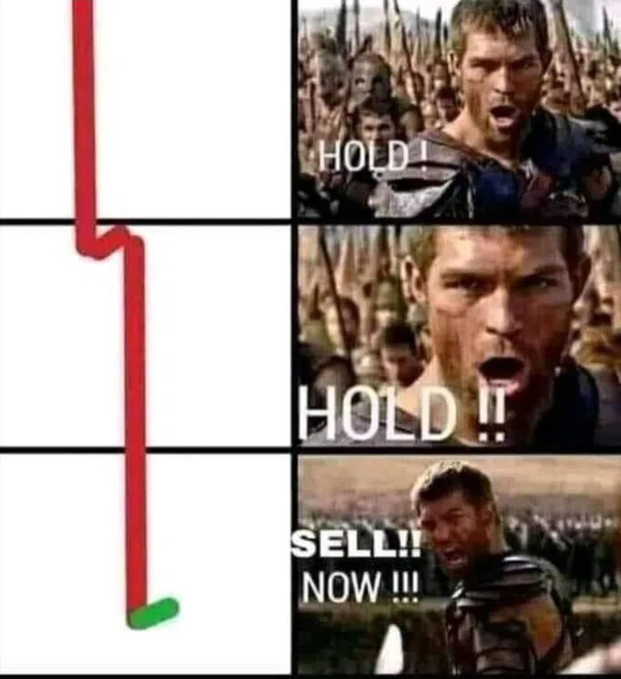

Puedes probar la aplicación desplegada [aquí](https://gregarious-dusk-5d357b.netlify.app/). :rocket:

# Websockets criptodashboard

Este dashboard se nutre principalmente de un websocket feed del que rescata la cotización en tiempo real de la cripto deseada, así como una API de la que extrae el los datos históricos de su cotización.

Podemos comprobar cualquier enlace ws en esta web: https://www.piesocket.com/websocket-tester

[Coinbase Websocket page](https://docs.cloud.coinbase.com/exchange/docs/websocket-overview).
wss://ws-feed.exchange.coinbase.com

A esta conexión hay que acompañarle un mensaje que confirme la suscripción al WS. Si dicho mensaje no se envía en menos de 5 segundos, la conexión se cae.

[Coinbase product candles](https://docs.cloud.coinbase.com/exchange/reference/exchangerestapi_getproductcandles).
https://api.exchange.coinbase.com/products/{product_id}/candles

A esta url hay que sustituir {product_id} por el producto a pedir 

